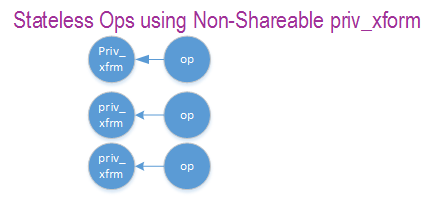
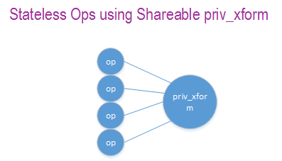
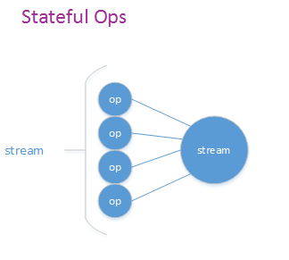

..  SPDX-License-Identifier: BSD-3-Clause
    Copyright(c) 2017-2018 Cavium Networks.

Compression Device Library
===========================

The compression framework provides a generic set of APIs to perform compression services
as well as to query and configure compression devices both physical(hardware) and virtual(software)
to perform those services. The framework currently only supports lossless compression schemes:
Deflate and LZS.

Device Management
-----------------

Device Creation
~~~~~~~~~~~~~~~

Physical compression devices are discovered during the PCI probe/enumeration of the
EAL function which is executed at DPDK initialization, based on their unique PCI device
identifier PCI BDF (bus/bridge, device, function). Specific physical
compression devices, like other physical devices in DPDK can be white-listed or
black-listed using the EAL command line options.

Virtual devices can be created by two mechanisms, either using the EAL command
line options or from within the application using an EAL API directly.

From the command line using the --vdev EAL option

.. code-block:: console

   --vdev  '<pmd name>,socket_id=0'

.. Note::

   * If DPDK application requires multiple software compression PMD devices then required
     number of ``--vdev`` with appropriate libraries are to be added.

   * An Application with compression PMD instaces sharing the same library requires unique ID.

   Example: ``--vdev  'compress_zlib0' --vdev  'compress_zlib1'``

Or, by using the rte_vdev_init API within the application code.

.. code-block:: c

   rte_vdev_init("<pmd_name>","socket_id=0")

All virtual compression devices support the following initialization parameters:

* ``socket_id`` - socket on which to allocate the device resources on.

Device Identification
~~~~~~~~~~~~~~~~~~~~~

Each device, whether virtual or physical is uniquely designated by two
identifiers:

- A unique device index used to designate the compression device in all functions
  exported by the compressdev API.

- A device name used to designate the compression device in console messages, for
  administration or debugging purposes.

Device Configuration
~~~~~~~~~~~~~~~~~~~~

The configuration of each compression device includes the following operations:

- Allocation of resources, including hardware resources if a physical device.
- Resetting the device into a well-known default state.
- Initialization of statistics counters.

The ``rte_compressdev_configure`` API is used to configure a compression device.

.. code-block:: c

   int rte_compressdev_configure(uint8_t dev_id,
                               struct rte_compressdev_config *config)

The ``rte_compressdev_config`` structure is used to pass the configuration
parameters for socket selection and number of queue pairs.

.. code-block:: c

    struct rte_compressdev_config {
		int socket_id;
		/**< Socket on which to allocate resources */
		uint16_t nb_queue_pairs;
		/**< Total number of queue pairs to configure on a device */
		uint16_t max_nb_priv_xforms;
		/**< Max number of private_xforms which will be created on the device */
		uint16_t max_nb_streams;
		/**< Max number of streams which will be created on the device */
	};

Configuration of Queue Pairs
~~~~~~~~~~~~~~~~~~~~~~~~~~~~

Each compression device queue pair is individually configured through the
``rte_compressdev_queue_pair_setup`` API.

.. code-block:: c

    int __rte_experimental
	rte_compressdev_queue_pair_setup(uint8_t dev_id, uint16_t queue_pair_id,
								uint32_t max_inflight_ops, int socket_id);

The ``max_inflight_ops`` is used to pass maximum number of
rte_comp_op that could be present in a queue at-a-time.
PMD then can allocate resources accordingly on a specified socket.

Logical Cores, Memory and Queues Pair Relationships
~~~~~~~~~~~~~~~~~~~~~~~~~~~~~~~~~~~~~~~~~~~~~~~~~~~

Library supports NUMA similarly as described in Cryptodev library section.

Multiple logical cores should never share the same queue pair for enqueuing
operations or dequeuing operations on the same compression device since this would
require global locks and hinder performance. It is however possible to use a
different logical core to dequeue an operation on a queue pair from the logical
core which it was enqueued on. This means that a compression burst enqueue/dequeue
APIs are a logical place to transition from one logical core to another in a
data processing pipeline.

Device Features and Capabilities
---------------------------------

Compression devices define their functionality through two mechanisms, global device
features and algorithm features. Global devices features identify device
wide level features which are applicable to the whole device such as supported hardware
acceleration and compression algorithms.

The algorithm features lists individual algo feature which device supports,
such as a stateful compression/decompression, checksums operation etc.

Device Features
~~~~~~~~~~~~~~~

Following are current Compression device feature flags:

* SSE accelerated SIMD vector operations
* AVX accelerated SIMD vector operations
* AVX2 accelerated SIMD vector operations
* AVX512 accelerated SIMD vector operations
* NEON accelerated SIMD vector operations
* Hardware off-load processing

Algorithm Features
~~~~~~~~~~~~~~~~~~

Following are current compression algorithms feature flags:

* Stateful Compression
* Stateful Decompression
* Scatter-Gather input/output
* Adler32 checksum generation
* CRC32 checksum generation
* Adler32 and CRC32 checksum generation
* Uncompressed blocks generation
* SHA1 and SHA2-256 hash digest calculation on plaintext
* Shareable priv_xform support for stateless operations

Capabilities
~~~~~~~~~~~~
Each PMD has a list of capabilities, including algorithms listed in
enum ``rte_comp_algorithm`` and its associated feature flag and
sliding window range in log base 2 value. Sliding window tells
the minimum and maximum size of lookup window that algorithm uses
to find duplicates.

See definition of compression device capability structure in the
*DPDK API Reference*.

.. code-block:: c

	struct rte_compressdev_capabilities {
		enum rte_comp_algorithm algo;
		/* Compression algorithm */
		uint64_t comp_feature_flags;
		/**< Bitmask of flags for compression service features */
		struct rte_param_log2_range window_size;
		/**< Window size range in base two log byte values */
	};

Each Compression poll mode driver defines its array of capabilities
for each algorithm it supports. Below is an example of PMD capabilities which supports
deflate algorithm RTE_COMP_ALGO_DEFLATE.

.. code-block:: c

    static const struct rte_compressdev_capabilities pmd_capabilities[] = {
        {    /* deflate */
		.algo = RTE_COMP_DEFLATE,
		.comp_feature_flags = (RTE_COMP_FF_ADLER32_CHECKSUM | RTE_COMP_FF_NONCOMPRESSED_BLOCKS),
		.window_size = {
			.min = 8,
			.max = 15,
			.increment = 2
		}
	};

Capabilities Discovery
~~~~~~~~~~~~~~~~~~~~~~

PMD capability and features are discovered via ``rte_compressdev_info_get`` function.

.. code-block:: c

   void rte_compressdev_info_get(uint8_t dev_id,
                               struct rte_compressdev_info *dev_info);

The ``rte_compressdev_info`` structure contains all the relevant information for the device.

.. code-block:: c

	struct rte_compressdev_info {
		const char *driver_name;		/**< Driver name. */
		uint64_t feature_flags;			/**< Feature flags */
		const struct rte_compressdev_capabilities *capabilities;
		/**< Array of devices supported capabilities */
		uint16_t max_nb_queue_pairs;
		/**< Maximum number of queues pairs supported by device. */
		/**< Maximum number of queues pairs supported by device.
		* (If 0, there is no limit in maximum number of queue pairs)
		*/
	};

Compression Operation
----------------------

DPDK compression supports two types of compression methodologies:

- Stateless, each data object is compressed individually without any reference to previous data

- Stateful, each data object is compressed with reference to previous data object i.e. history of data is needed for compression / decompression.

For more explanation, please refer RFC https://www.ietf.org/rfc/rfc1951.txt

Operation Representation
~~~~~~~~~~~~~~~~~~~~~~~~

Compression operation is described via ``struct rte_comp_op``. The operation structure
includes the operation type (stateless or stateful), the operation status
and the priv_xform/stream handle, source, destination and checksum buffer
pointers. It also contains the source mempool for the operation are allocated
from. PMD consumes the input as mentioned in consumed field and update
produced with amount of data of written into destination buffer along with
status of operation.

Compression operations mempool also has an ability to allocate private memory with the
operation for applications purposes. Application software is responsible for specifying
all the operation specific fields in the ``rte_comp_op`` structure which are then used
by the compression PMD to process the requested operation.

.. code-block:: c

	struct rte_comp_op {

		enum rte_comp_op_type op_type;
		union {
			void *private_xform;
			/**< Stateless private PMD data derived from an rte_comp_xform.
			 * A handle returned by rte_compressdev_private_xform_create()
			 * must be attached to operations of op_type RTE_COMP_STATELESS.
			 */
			void *stream;
			/**< Private PMD data derived initially from an rte_comp_xform,
			 * which holds state and history data and evolves as operations
			 * are processed. rte_compressdev_stream_create() must be called
			 * on a device for all STATEFUL data streams and the resulting
			 * stream attached to the one or more operations associated
			 * with the data stream.
			 * All operations in a stream must be sent to the same device.
			 */
		};

		struct rte_mempool *mempool;
		/**< Pool from which operation is allocated */
		rte_iova_t iova_addr;
		/**< IOVA address of this operation */
		struct rte_mbuf *m_src;
		/**< source mbuf
		 * The total size of the input buffer(s) can be retrieved using
		 * rte_pktmbuf_data_len(m_src)
		 */
		struct rte_mbuf *m_dst;
		/**< destination mbuf
		 * The total size of the output buffer(s) can be retrieved using
		 * rte_pktmbuf_data_len(m_dst)
		 */

		struct {
			uint32_t offset;
			/**< Starting point for compression or decompression,
			 * specified as number of bytes from start of packet in
			 * source buffer.
			 * Starting point for checksum generation in compress direction.
			 */
			uint32_t length;
			/**< The length, in bytes, of the data in source buffer
			 * to be compressed or decompressed.
			 * Also the length of the data over which the checksum
			 * should be generated in compress direction
			 */
		} src;
		struct {
			uint32_t offset;
			/**< Starting point for writing output data, specified as
			 * number of bytes from start of packet in dest
			 * buffer. Starting point for checksum generation in
			 * decompress direction.
			 */
		} dst;
		struct {
			uint8_t *digest;
			/**< Output buffer to store hash output, if enabled in xform.
			 * Buffer would contain valid value only after an op with
			 * flush flag = RTE_COMP_FLUSH_FULL/FLUSH_FINAL is processed
			 * successfully.
			 *
			 * Length of buffer should be contiguous and large enough to
			 * accommodate digest produced by specific hash algo.
			 */
			rte_iova_t iova_addr;
			/**< IO address of the buffer */
		} hash;
		enum rte_comp_flush_flag flush_flag;
		/**< Defines flush characteristics for the output data.
		 * Only applicable in compress direction
		 */
		uint64_t input_chksum;
		/**< An input checksum can be provided to generate a
		 * cumulative checksum across sequential blocks in a STATELESS stream.
		 * Checksum type is as specified in xform chksum_type
		 */
		uint64_t output_chksum;
		/**< If a checksum is generated it will be written in here.
		 * Checksum type is as specified in xform chksum_type.
		 */
		uint32_t consumed;
		/**< The number of bytes from the source buffer
		 * which were compressed/decompressed.
		 */
		uint32_t produced;
		/**< The number of bytes written to the destination buffer
		 * which were compressed/decompressed.
		 */
		uint64_t debug_status;
		/**<
		 * Status of the operation is returned in the status param.
		 * This field allows the PMD to pass back extra
		 * pmd-specific debug information. Value is not defined on the API.
		 */
		uint8_t status;
		/**<
		 * Operation status - use values from enum rte_comp_status.
		 * This is reset to
		 * RTE_COMP_OP_STATUS_NOT_PROCESSED on allocation from mempool and
		 * will be set to RTE_COMP_OP_STATUS_SUCCESS after operation
		 * is successfully processed by a PMD
		 */
	} __rte_cache_aligned;

Operation Management and Allocation
~~~~~~~~~~~~~~~~~~~~~~~~~~~~~~~~~~~

The compressdev library provides an API set for managing compression operations which
utilize the Mempool Library to allocate operation buffers. Therefore, it ensures
that the compression operation is interleaved optimally across the channels and
ranks for optimal processing.
A ``rte_comp_op`` contains a field indicating the pool that it originated from.
When calling ``rte_comp_op_free(op)``, the operation returns to its original pool.

.. code-block:: c

   struct rte_mempool *rte_comp_op_pool_create(const char *name,
						unsigned int nb_elts, unsigned int cache_size,
						uint16_t user_size, int socket_id);

``rte_comp_op_alloc()`` and ``rte_comp_op_bulk_alloc()`` are used to allocate
compression operations from a given compression operation mempool.
The operation gets reset before being returned to a user so that operation
is always in a good known state before use by the application.

.. code-block:: c

	struct rte_comp_op *rte_comp_op_alloc(struct rte_mempool *mempool)

	int rte_comp_op_bulk_alloc(struct rte_mempool *mempool,
					struct rte_comp_op **ops, uint16_t nb_ops)

``rte_comp_op_free()`` is called by the application to return an operation to
its allocating pool.

.. code-block:: c

   void rte_comp_op_free(struct rte_comp_op *op)

Passing source data as mbuf-chain
~~~~~~~~~~~~~~~~~~~~~~~~~~~~~~~~~~
If input data is scattered across several different buffers, then
Application can either parse through all such buffers and make one
mbuf-chain and enqueue it for processing or, alternatively, it can
make multiple sequential enqueue_burst() calls for each of them
processing them statefully. See *Compression API Stateful Operation*
for stateful processing of ops.

Operation Status
~~~~~~~~~~~~~~~~
Each operation carries a status information updated by PMD after it is processed.
following are currently supported status:

- RTE_COMP_OP_STATUS_SUCCESS,
	Operation is successfully completed.

- RTE_COMP_OP_STATUS_NOT_PROCESSED,
	Operation has not yet been processed by the device

- RTE_COMP_OP_STATUS_INVALID_ARGS,
	Operation failed due to invalid arguments in request

- RTE_COMP_OP_STATUS_ERROR,
	Operation failed because of internal error

- RTE_COMP_OP_STATUS_INVALID_STATE,
	Operation is invoked in invalid state

- RTE_COMP_OP_STATUS_OUT_OF_SPACE_TERMINATED,
	Output buffer ran out of space during processing. Error case,
	PMD cannot continue from here.

- RTE_COMP_OP_STATUS_OUT_OF_SPACE_RECOVERABLE,
	Output buffer ran out of space before operation completed, but this
	is not an error case. Output data up to op.produced can be used and
	next op in the stream should continue on from op.consumed+1.

Produced, Consumed And Operation Status
~~~~~~~~~~~~~~~~~~~~~~~~~~~~~~~~~~~~~~~

- If status is RTE_COMP_OP_STATUS_SUCCESS,
	consumed = amount of data read from input buffer, and
	produced = amount of data written in destination buffer
- If status is RTE_COMP_OP_STATUS_FAILURE,
	consumed = produced = 0 or undefined
- If status is RTE_COMP_OP_STATUS_OUT_OF_SPACE_TERMINATED,
	consumed = 0 and
	produced = amount of data successfully produced until
	out of space condition hit.	Application can consume output data, if required.
- If status is RTE_COMP_OP_STATUS_OUT_OF_SPACE_RECOVERABLE,
	consumed = amount of data read, and
	produced = amount of data successfully produced until
	out of space condition hit.	PMD has ability to recover
	from here, so application can submit next op from
	consumed+1 and a destination buffer with available space.

Transforms and Transform Chaining
----------------------------------

Compression transforms (``rte_comp_xform``) are the mechanism
to specify the details of the compression operation.
Currently chaining is not supported on compression API.

.. code-block:: c

	struct rte_comp_xform {
		struct rte_comp_xform *next;
		/**< next xform in chain */
		enum rte_comp_xform_type type;
		/**< xform type */
		union {
			struct rte_comp_compress_xform compress;
			/**< xform for compress operation */
			struct rte_comp_decompress_xform decompress;
			/**< decompress xform */
		};
	};

Compression API Hash support
----------------------------

Compression API allows application to enable digest calculation
alongside compression and decompression of data. A PMD reflects its
support for hash algorithms via capability algo feature flags.
If supported, PMD calculates digest always on plaintext i.e.
before compression and after decompression.

Currently supported list of hash algos are SHA-1 and SHA2 family
SHA256.

.. code-block:: c

	enum rte_comp_hash_algorithm {
		RTE_COMP_HASH_ALGO_UNSPECIFIED = 0,
		/**< No hash */
		RTE_COMP_HASH_ALGO_SHA1,
		/**< SHA1 hash algorithm */
		RTE_COMP_HASH_ALGO_SHA2_256,
		/**< SHA256 hash algorithm of SHA2 family */
		RTE_COMP_HASH_ALGO_LIST_END
	};

If required, application should set valid hash algo in compress
or decompress xforms during ``rte_compressdev_stream_create()``
or ``rte_compressdev_private_xform_create()`` and pass a valid
output buffer in ``rte_comp_op`` hash field struct to store the
resulting digest. Buffer passed should be contiguous and large
enough to store digest which is 20 bytes for SHA-1 and
32 bytes for SHA2-256.

Compression API Stateless operation
------------------------------------

An op is processed stateless if it has
- op_type set to RTE_COMP_OP_STATELESS
- flush value set to RTE_FLUSH_FULL or RTE_FLUSH_FINAL
(required only on compression side),
- All required input in source buffer

When all of the above conditions are met, PMD initiates stateless processing
and releases acquired resources after processing of current operation is
complete. Application can enqueue multiple stateless ops in a single burst
and must attach priv_xform handle to such ops.

priv_xform in Stateless operation
~~~~~~~~~~~~~~~~~~~~~~~~~~~~~~~~~~

priv_xform is PMD internally managed private data that it maintains to do stateless processing.
priv_xforms are initialized provided a generic xform structure by an application via making call
to ``rte_comp_priv_xform_create``, at an output PMD returns an opaque priv_xform reference with
flag set to SHAREABLE or NON_SHAREABLE. If PMD support SHAREABLE priv_xform, then application
can attach same priv_xform with many stateless ops at-a-time. If not, then application needs to
create as many priv_xforms as it expects to have stateless operations in-flight.

Application should call ``rte_compressdev_private_xform_create()`` and attach to stateless op before
engueing them for processing and free via ``rte_compressdev_private_xform_free()`` during termmination.

.. code-block:: c

   int __rte_experimental  rte_compressdev_private_xform_create(uint8_t dev_id,
                                        const struct rte_comp_xform *xform,
                                        void **private_xform);

   int __rte_experimental  rte_compressdev_private_xform_free(uint8_t dev_id, void *private_xform);

A pseudocode example to setup and process NUM_OPS stateless ops with each of length OP_LEN
using shareable priv_xform would look like:

.. code-block:: c

	/*
     * Pseudo code example to do stateless compression
     */

	/* Create  operation pool. */
    op_pool = rte_comp_op_pool_create("comp_op_pool",
						NUM_OPS,
						POOL_CACHE_SIZE,
						0,
						socket_id);
    if (op_pool == NULL)
        rte_exit(EXIT_FAILURE, "Cannot create op pool\n");

    /* Create the virtual device. */

	/* Create the compress transform. */
    struct rte_compress_compress_xform compress_xform = {
        .next = NULL,
		.type = RTE_COMP_COMPRESS,
		.compress = {
			.algo = RTE_COMP_ALGO_DEFLATE,
			.deflate = {
				.huffman = RTE_COMP_HUFFMAN_DEFAULT
			},
			.level = RTE_COMP_LEVEL_PMD_DEFAULT,
			.chksum = RTE_COMP_CHECKSUM_NONE,
			.window_size = DEFAULT_WINDOW_SIZE,
			.hash_algo = RTE_COMP_HASH_ALGO_UNSPECIFIED
		}
    };

    /* Create stream and initialize it for the compression device. */
	if( priv xform shareable )
		ret = rte_comp_priv_xform_create(cdev_id, &xform, &priv_xform);
	else
		non-shareable = 1;

	/* Get a burst of operations. */
    struct rte_comp_op *comp_ops[CHUNK_LEN];
    if (rte_comp_op_bulk_alloc(op_pool, comp_ops, OP_LEN) == 0)
        rte_exit(EXIT_FAILURE, "Not enough compression operations available\n");

    /* Get a burst of src and dst mbufs. */

    /* Prepare source and destination mbufs for compression operations */
    unsigned int i;
    for (i = 0; i < NUM_OPS; i++) {
        if (rte_pktmbuf_append(mbufs[i], OP_LEN) == NULL)
            rte_exit(EXIT_FAILURE, "Not enough room in the mbuf\n");
        comp_ops[i]->m_src = mbufs[i];
		 if (rte_pktmbuf_append(dst_mbufs[i], OP_LEN) == NULL)
            rte_exit(EXIT_FAILURE, "Not enough room in the mbuf\n");
        comp_ops[i]->m_dst = dst_mbufs[i];
    }

    /* Set up the compress operations. */
    for (i = 0; i < NUM_OPS; i++) {
        struct rte_comp_op *op = comp_ops[i];
		if (non-shareable)
			rte_priv_xform_create(cdev_id, &compress_xform, &op->priv_xform)
		else
			op->priv_xform = priv_xform;
		op->type = RTE_COMP_OP_STATELESS;
		op->flush = RTE_COMP_FLUSH_FINAL;

		op->src.offset = 0;
		op->dst.offset = 0;
		op->src.length = OP_LEN;
		op->input_chksum = 0;
	}
	num_enqd = rte_compressdev_enqueue_burst(cdev_id, 0, comp_ops, NUM_OPS);
	/* wait for this to complete before enqueing next*/
	do {
	num_deque = rte_compressdev_dequeue_burst(cdev_id, 0 , &processed_ops, NUM_OPS);
	}while (num_dqud < num_enqd);

Stateless and OUT_OF_SPACE
~~~~~~~~~~~~~~~~~~~~~~~~~~~~

OUT_OF_SPACE is a condition when output buffer runs out of space and where PMD
still has more data to produce. If PMD runs into such condition, then PMD returns
RTE_COMP_OP_OUT_OF_SPACE_TERMINATED error. In such case, PMD resets itself and can set
consumed=0 and produced=amount of output it could produce before hitting out_of_space.
Application would need to resubmit the whole input with a larger output buffer, if it
wants the operation to be completed.

Hash in Stateless
~~~~~~~~~~~~~~~~~
If hash is enabled, digest buffer will contain valid data after op is successfully
processed i.e. dequeued with status = RTE_COMP_OP_STATUS_SUCCESS.

Compression API Stateful operation
-----------------------------------

Compression API provide RTE_COMP_FF_STATEFUL_COMPRESSION and
RTE_COMP_FF_STATEFUL_DECOMPRESSION feature flag for PMD to reflect
its support for Stateful operations.

A Stateful operation in DPDK compression means application invokes enqueue
burst() multiple times to process related chunk of data because
application broke data into several ops.

In such case
- ops are setup with op_type RTE_COMP_OP_STATEFUL,
- all ops except last set to flush value = RTE_COMP_NO/SYNC_FLUSH
and last set to flush value RTE_COMP_FULL/FINAL_FLUSH.

In case of either one or all of the above conditions, PMD initiates
stateful processing and releases acquired resources after processing
operation with flush value = RTE_COMP_FLUSH_FULL/FINAL is complete.
Unlike stateless, application can enqueue only one stateful op from
a particular stream in a single burst and must attach stream handle
to each op.

Stream in Stateful operation
~~~~~~~~~~~~~~~~~~~~~~~~~~~~

`stream` in DPDK compression is a logical entity which identifies related set of ops, say, a one large
file broken into multiple chunks then file is represented by a stream and each chunk of that file is
represented by compression op `rte_comp_op`. Whenever application wants a stateful processing of such
data, then it must get a stream handle via making call to ``rte_comp_stream_create()``
with xform, at an output the target PMD will return an opaque stream handle to application which
it must attach to all of the ops carrying data of that stream. In stateful processing, every op
requires previous op data for compression/decompression. A PMD allocates and set up resources such
as history, states, etc. within a stream, which are maintained during the processing of the related ops.

Unlike priv_xforms, stream is always a NON_SHAREABLE entity. One stream handle must be attached to only
one set of related ops and cannot be reused until all of them are processed with status Success or failure.

Application should call ``rte_comp_stream_create()`` and attach to op before
enqueuing them for processing and free via ``rte_comp_stream_free()`` during
termination. All ops that are to be processed statefully should carry *same* stream.

.. code-block:: c

   int __rte_experimental  rte_compressdev_stream_create(uint8_t dev_id,
	                                      const struct rte_comp_xform *xform,
                                          void **stream);

   int __rte_experimental  rte_compressdev_stream_free(uint8_t dev_id, void *stream);

A pseudo code example to set up and process a stream having NUM_CHUNKS with each chunk size of CHUNK_LEN would look like:

.. code-block:: c

	 /*
     * Simple example to do stateful compression
     */

	/* Create  operation pool. */
    op_pool = rte_comp_op_pool_create("comp_op_pool",
					NUM_CHUNKS,
					POOL_CACHE_SIZE,
					0,
					socket_id);
    if (op_pool == NULL)
        rte_exit(EXIT_FAILURE, "Cannot create op pool\n");

    /* Create the virtual device. */

	/* Create the compress transform. */
    struct rte_compress_compress_xform compress_xform = {
        .next = NULL,
		.type = RTE_COMP_COMPRESS,
		.compress = {
			.algo = RTE_COMP_ALGO_DEFLATE,
			.deflate = {
				.huffman = RTE_COMP_HUFFMAN_DEFAULT
			},
			.level = RTE_COMP_LEVEL_PMD_DEFAULT,
			.chksum = RTE_COMP_CHECKSUM_NONE,
			.window_size = DEFAULT_WINDOW_SIZE,
                        .hash_algo = RTE_COMP_HASH_ALGO_UNSPECIFIED
		}
    };

    /* Create stream and initialize it for the compression device. */
	rte_comp_stream_create(cdev_id, &xform, &stream);

	/* Get a burst of operations. */
    struct rte_comp_op *comp_ops[CHUNK_LEN];
    if (rte_comp_op_bulk_alloc(op_pool, comp_ops, CHUNK_LEN) == 0)
        rte_exit(EXIT_FAILURE, "Not enough compression operations available\n");

    /* Get a burst of src and dst mbufs. */

    /* Prepare source and destination mbufs for compression operations */
    unsigned int i;
    for (i = 0; i < NUM_CHUNKS; i++) {
        if (rte_pktmbuf_append(mbufs[i], CHUNK_LEN) == NULL)
            rte_exit(EXIT_FAILURE, "Not enough room in the mbuf\n");
        comp_ops[i]->m_src = mbufs[i];
		 if (rte_pktmbuf_append(dst_mbufs[i], CHUNK_LEN) == NULL)
            rte_exit(EXIT_FAILURE, "Not enough room in the mbuf\n");
        comp_ops[i]->m_dst = dst_mbufs[i];
    }

    /* Set up the compress operations. */
    for (i = 0; i < NUM_CHUNKS; i++) {
        struct rte_comp_op *op = comp_ops[i];

		op->stream = stream;
		op->m_src = src_buf[i];
		op->m_dst = dst_buf[i];
		op->type = RTE_COMP_OP_STATEFUL;
		if(i == NUM_CHUNKS-1) {
		/* set to final, if last chunk*/
		op->flush = RTE_COMP_FLUSH_FINAL;
		} else {
		/* set to NONE, for all intermediary ops*/
		op->flush = RTE_COMP_FLUSH_NONE;
		}
		op->src.offset = 0;
		op->dst.offset = 0;
		op->src.length = CHUNK_LEN;
		op->input_chksum = 0;
		num_enqd = rte_compressdev_enqueue_burst(cdev_id, 0, &op[i],1);
		/* wait for this to complete before enqueing next*/
		do {
		num_deqd = rte_compressdev_dequeue_burst(cdev_id, 0 , &processed_ops, 1);
		}while (num_deqd < num_enqd);
		/* push next op*/
	}

Stateful and OUT_OF_SPACE
~~~~~~~~~~~~~~~~~~~~~~~~~~~

If PMD supports stateful operation, then OUT_OF_SPACE status is not an actual
error for the PMD. In such case, PMD returns with status
RTE_COMP_OP_STATUS_OUT_OF_SPACE_RECOVERABLE with consumed = number of input bytes
read and produced = length of complete output buffer.
Application should enqueue next op with source starting at consumed+1 and an
output buffer with available space.

Hash in Stateful
~~~~~~~~~~~~~~~~
If enabled, digest buffer will contain valid digest after last op in stream
(having flush=RTE_COMP_OP_FLUSH_FINAL) is successfully processed i.e. dequeued
with status = RTE_COMP_OP_STATUS_SUCCESS.

Burst in compression API
-------------------------

Scheduling of compression operations on DPDK's application data path is
performed using a burst oriented asynchronous API set. A queue pair on a compression
device accepts a burst of compression operations using enqueue burst API. On physical
devices the enqueue burst API will place the operations to be processed
on the device's hardware input queue, for virtual devices the processing of the
operations is usually completed during the enqueue call to the compression
device. The dequeue burst API will retrieve any processed operations available
from the queue pair on the compression device, from physical devices this is usually
directly from the devices processed queue, and for virtual device's from a
``rte_ring`` where processed operations are place after being processed on the
enqueue call.

A burst in DPDK compression can be a combination of stateless and stateful operations with a condition
that for stateful ops only one op at-a-time should be enqueued from a particular stream i.e. no-two ops
should belong to same stream in a single burst i.e. a burst can look like:

+--------------+-------------+--------------+-----------------+--------------+--------------+
|enqueue_burst |op1.no_flush | op2.no_flush | op3.flush_final | op4.no_flush | op5.no_flush |
+--------------+-------------+--------------+-----------------+---------------+-------------+

Where, op1 .. op5 all belong to different independent data units and can be of type : stateless or stateful.
Every op with type set to RTE_COMP_OP_TYPE_STATELESS must be attached to priv_xform and
Every op with type set to RTE_COMP_OP_TYPE_STATEFUL *must* be attached to stream.

Since each operation in a burst is independent and thus can be completed
out-of-order,  applications which need ordering, should setup per-op user data
area with reordering information so that it can determine enqueue order at
dequeue.

Also if multiple threads calls enqueue_burst() on same queue pair then it’s
application onus to use proper locking mechanism to ensure exclusive enqueuing
of operations.

Enqueue / Dequeue Burst APIs
~~~~~~~~~~~~~~~~~~~~~~~~~~~~

The burst enqueue API uses a compression device identifier and a queue pair
identifier to specify the compression device queue pair to schedule the processing on.
The ``nb_ops`` parameter is the number of operations to process which are
supplied in the ``ops`` array of ``rte_comp_op`` structures.
The enqueue function returns the number of operations it actually enqueued for
processing, a return value equal to ``nb_ops`` means that all packets have been
enqueued.

.. code-block:: c

   uint16_t rte_compressdev_enqueue_burst(uint8_t dev_id, uint16_t qp_id,
						struct rte_comp_op **ops, uint16_t nb_ops)

The dequeue API uses the same format as the enqueue API of processed but
the ``nb_ops`` and ``ops`` parameters are now used to specify the max processed
operations the user wishes to retrieve and the location in which to store them.
The API call returns the actual number of processed operations returned, this
can never be larger than ``nb_ops``.

.. code-block:: c

   uint16_t rte_compressdev_dequeue_burst(uint8_t dev_id, uint16_t qp_id,
                                        struct rte_comp_op **ops, uint16_t nb_ops);

Sample code
-----------

There are unit test applications that show how to use the compressdev library inside
test/test/test_compressdev.c

The following sample code shows the basic steps to compress several stateless buffers
using deflate, using one of the sudo compress PMDs available in DPDK.

.. code-block:: c

	 /*
     * Simple example to do stateless compression
     */

    #define NUM_MBUFS            1024
    #define POOL_CACHE_SIZE      128
    #define BURST_SIZE           32
    #define BUFFER_SIZE          1024

    struct rte_mempool *mbuf_pool, *op_pool, *session_pool;
    unsigned int session_size;
    int ret;
	int shareable = 1;

    /* Initialize EAL. */
    ret = rte_eal_init(argc, argv);
    if (ret < 0)
        rte_exit(EXIT_FAILURE, "Invalid EAL arguments\n");

    uint8_t socket_id = rte_socket_id();

    /* Create the mbuf pool. */
    mbuf_pool = rte_pktmbuf_pool_create("mbuf_pool",
                                    NUM_MBUFS*2,
                                    POOL_CACHE_SIZE,
                                    0,
                                    RTE_MBUF_DEFAULT_BUF_SIZE,
                                    socket_id);
    if (mbuf_pool == NULL)
        rte_exit(EXIT_FAILURE, "Cannot create mbuf pool\n");

    /* Create  operation pool. */
    op_pool = rte_comp_op_pool_create("comp_op_pool",
										NUM_MBUFS,
                                        POOL_CACHE_SIZE,
                                        0,
                                        socket_id);
    if (op_pool == NULL)
        rte_exit(EXIT_FAILURE, "Cannot create  op pool\n");

    /* Create the virtual  device. */
    char args[128];
    const char *comp_name = "còmpress_null";
    snprintf(args, sizeof(args), "socket_id=%d", socket_id);
    ret = rte_vdev_init(comp_name, args);
    if (ret != 0)
        rte_exit(EXIT_FAILURE, "Cannot create virtual device");

    uint8_t cdev_id = rte_compdev_get_dev_id(comp_name);

    /* Configure the  device. */
    struct rte_compressdev_config conf = {
        .nb_queue_pairs = 1,
        .socket_id = socket_id
		.max_nb_priv_xforms = BURST_SIZE,
		.max_nb_streams = 0
    };

    if (rte_compressdev_configure(cdev_id, &conf) < 0)
        rte_exit(EXIT_FAILURE, "Failed to configure compressdev %u", cdev_id);

    if (rte_compressdev_queue_pair_setup(cdev_id, 0, NUM_MAX_INFLIGHT_OPS,
									socket_id()) < 0)
        rte_exit(EXIT_FAILURE, "Failed to setup queue pair\n");

    if (rte_compressdev_start(cdev_id) < 0)
        rte_exit(EXIT_FAILURE, "Failed to start device\n");

    /* Create the compress transform. */
    struct rte_compress_compress_xform compress_xform = {
        .next = NULL,
		.type = RTE_COMP_COMPRESS,
		.compress = {
			.algo = RTE_COMP_ALGO_DEFLATE,
			.deflate = {
				.huffman = RTE_COMP_HUFFMAN_DEFAULT
			},
			.level = RTE_COMP_LEVEL_PMD_DEFAULT,
			.chksum = RTE_COMP_CHECKSUM_NONE,
			.window_size = DEFAULT_WINDOW_SIZE,
			.hash_algo = RTE_COMP_HASH_ALGO_UNSPECIFIED
		}
    };

    /* Create priv_xform and initialize it for the compression device. */
    void *priv_xform = NULL;
    rte_compressdev_info_get(cdev_id, &dev_info);
    if(dev_info.capability->comps_feature_flag & RTE_COMP_FF_SHAREABLE_PRIV_XFORM) {
        rte_comp_priv_xform_create(cdev_id, &compress_xform, &priv_xform);
        rte_log(INFO, "using shareable priv_xform\n");
    }
    else {
            rte_log(INFO, "priv_xform is non-shareable");
            shareable = 0;
         }

    /* Get a burst of operations. */
    struct rte_comp_op *comp_ops[BURST_SIZE];
    if (rte_comp_op_bulk_alloc(op_pool, comp_ops, BURST_SIZE) == 0)
        rte_exit(EXIT_FAILURE, "Not enough compression operations available\n");

    /* Get a burst of mbufs. */
    struct rte_mbuf *mbufs[BURST_SIZE];
	struct rte_mbuf *dst_mbufs[BURST_SIZE];

    if (rte_pktmbuf_alloc_bulk(mbuf_pool, mbufs, BURST_SIZE) < 0)
        rte_exit(EXIT_FAILURE, "Not enough mbufs available");

	if (rte_pktmbuf_alloc_bulk(mbuf_pool, dst_mbufs, BURST_SIZE) < 0)
        rte_exit(EXIT_FAILURE, "Not enough mbufs available");

    /* Prepare source and destination mbufs for compression operations */
    unsigned int i;
    for (i = 0; i < BURST_SIZE; i++) {
        if (rte_pktmbuf_append(mbufs[i], BUFFER_SIZE) == NULL)
            rte_exit(EXIT_FAILURE, "Not enough room in the mbuf\n");
        comp_ops[i]->m_src = mbufs[i];
		 if (rte_pktmbuf_append(dst_mbufs[i], BUFFER_SIZE) == NULL)
            rte_exit(EXIT_FAILURE, "Not enough room in the mbuf\n");
        comp_ops[i]->m_dst = dst_mbufs[i];
    }

    /* Set up the compress operations. */
    for (i = 0; i < BURST_SIZE; i++) {
        struct rte_comp_op *op = comp_ops[i];
		if(i && !shareable) {
			/* allocate separate xform for each op */
			rte_compressdev_private_xform_create(cdev_id, &compress_xform, &op->private_xform);
		} else {
			/* Attach the priv_xform to the operation */
			op->priv_xform = priv_xform;
		}
		op->src.offset = 0;
		op->src.length = BUFFER_SIZE;
		op->dst.offset = 0;
		op->type = RTE_COMP_OP_STATELESS;
		op->flush = RTE_COMP_FLUSH_FINAL;
		op->mempool = op_pool;
	}

    /* Enqueue the operations on device. */
    uint16_t num_enqueued_ops = rte_compressdev_enqueue_burst(cdev_id, 0,
                                            comp_ops, BURST_SIZE);

    /*
     * Dequeue operations until all the operations
     * are proccessed
     */
    uint16_t num_dequeued_ops, total_num_dequeued_ops = 0;
    do {
        struct rte_comp_op *dequeued_ops[BURST_SIZE];
        num_dequeued_ops = rte_compressdev_dequeue_burst(cdev_id, 0,
                                        dequeued_ops, BURST_SIZE);
        total_num_dequeued_ops += num_dequeued_ops;

        /* Check if operation was processed successfully */
        for (i = 0; i < num_dequeued_ops; i++) {
            if (dequeued_ops[i]->status != RTE_COMP_OP_STATUS_SUCCESS)
                rte_exit(EXIT_FAILURE,
                        "Some operations were not processed correctly");
            rte_comp_op_free(dequeued_ops[i]);
        }

        rte_mempool_put_bulk(op_pool, (void **)dequeued_ops,
                                            num_dequeued_ops);
    } while (total_num_dequeued_ops < num_enqueued_ops);

Compression Device API
~~~~~~~~~~~~~~~~~~~~~~

The compressdev Library API is described in the *DPDK API Reference* document.
